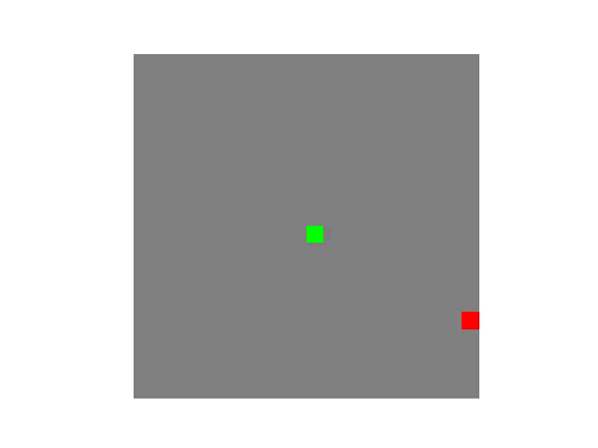

# 🐍 Reinforcement Learning for Snake Game

## 📌 Overview
This repository contains an implementation of a Reinforcement Learning (RL) agent that learns to play the Snake game using a Convolutional Neural Network (CNN) policy. The project is built using PyTorch and OpenAI Gym, utilizing multiple RL techniques including Policy Gradient and Random Agent Baseline.

## ✨ Features
- 🎮 Custom `SnakeEnv` built using OpenAI Gym
- 🧠 CNN-based policy network for reinforcement learning
- 📈 Training using the **Policy Gradient method**
- 🎯 Baseline **Random Agent** for comparison
- 🏆 Evaluation of the trained agent
- 🎥 Visualization of the agent's gameplay

## 🔧 Installation
### Prerequisites
Make sure you have the following dependencies installed:
- Python 3.8+
- PyTorch
- NumPy
- OpenAI Gym
- Matplotlib
- Pillow

To install the required dependencies, run:
```bash
pip install torch torchvision gym numpy matplotlib pillow
```

## 🚀 Usage
### 🏋️ Training the Agent
To train the agent, run:
```bash
python train.py
```
This will train the CNN-based policy network using the **Policy Gradient method** for `EPISODES` episodes.

### 📊 Evaluating the Agent
To evaluate the trained policy, run:
```bash
python evaluate.py
```
This will run the trained agent for `n_eval_episodes` episodes and compute the mean and standard deviation of the rewards.

### 🎬 Visualizing the Gameplay
To generate an animation of the agent playing the game, run:
```bash
python visualize.py
```
This will save images of the agent's gameplay and create an animated visualization.

---

## 📜 Formal Definition of the Environment
The environment follows the **Markov Decision Process (MDP)** formulation with:
- **State Space (S):** A 2D grid representation of the Snake game
- **Action Space (A):** {Up, Down, Left, Right} (Discrete)
- **Transition Function (T):** Moves the snake in the chosen direction, updating the environment
- **Reward Function (R):**
  - Eating an apple: `+1`
  - Hitting a wall or itself: `-1` (game over)
  - Living time step: `0`

```python
class SnakeEnv(gym.Env):
    def __init__(self, grid_size=10, initial_length=3):
        self.grid_size = grid_size
        self.initial_length = initial_length
        self.action_space = spaces.Discrete(4)
        self.observation_space = spaces.Box(0, 2, (grid_size, grid_size), dtype=np.uint8)
        self.reset()
```

---

## 🏛️ Algorithms Used
### 🎲 Random Agent (Baseline)
A simple baseline agent that selects actions randomly:
- Acts as a control to measure improvement over random play
- Uses `random.choice()` to select a move from available actions
- Provides a benchmark for reinforcement learning models

```python
class RandomAgentPolicy():
    def act(self, state):
        return random.choice(list(range(4))), None
```

## 🎥 Random Agent Gameplay
Here is a demo of the random agent playing Snake:




### 🧠 Policy Gradient Method (Reinforcement Learning)
The main training approach used is the **Policy Gradient** method:

#### 🔍 Pseudocode
```
Initialize Policy Network π_θ
For each episode:
    Reset environment
    Observe initial state s_0
    While not terminal state:
        Sample action a_t ~ π_θ(s_t)
        Apply action, get reward r_t and next state s_{t+1}
        Store (s_t, a_t, r_t)
    Compute discounted rewards G_t
    Compute policy gradient loss L(θ)
    Update θ using gradient descent
```

#### 📝 Implementation
```python
def compute_discounted_rewards(rewards, gamma=0.99):
    discounted_rewards = []
    cumulative_reward = 0
    for reward in reversed(rewards):
        cumulative_reward = reward + gamma * cumulative_reward
        discounted_rewards.insert(0, cumulative_reward)
    return torch.FloatTensor(discounted_rewards)
```

---

## 🏗️ Hyperparameter Tuning
We experimented with various hyperparameters to optimize performance:

| Hyperparameter | Value Range | Best Found |
|---------------|------------|------------|
| Learning Rate | {1e-4, 1e-3, 1e-2} | `1e-3` |
| Discount Factor (γ) | {0.7, 0.9, 0.95} | `0.95` |
| Episodes | {3K, 5K, 10K} | `5K` |
| Max Steps | {500, 800, 1000} | `800` |

### 🤖 GPT Usage
GPT was used for:
- **Code optimization**: Generating efficient RL training loops
- **Bug fixing**: Debugging PyTorch tensor operations
- **Hyperparameter insights**: Suggesting appropriate learning rates

---

## 📈 Results
- The agent improved significantly over the random policy.
- Average reward increased from `-0.5` (random) to `2.8+` (trained model).
- Training progress visualization:

```python
plt.plot(list(range(len(rewards))), rewards)
plt.xlabel("Episodes")
plt.ylabel("Total Reward")
plt.title("Training Progress")
plt.show()
```

### 🏆 Performance Metrics
Results were measured over 50 evaluation episodes:
| Model | Mean Reward | Standard Deviation |
|----------------|--------------|------------------|
| Random Agent | -0.98 | 0.14 |
| Trained v1 (γ=0.95, 5K episodes) | 0.06 | 0.58 |
| Trained v2 (γ=0.7, 5K episodes) | -0.42 | 0.57 |
| Trained v3 (γ=0.95, 20K episodes) | 4.0 | 2.72 |

---

## 🔮 Future Improvements
- 🚀 Implement **Deep Q-Network (DQN)** for better performance
- 🏗 Train on **larger grid sizes** for more complex strategies
- ⚡ Experiment with **different reward functions** for better learning

## 📜 License
This project is licensed under the MIT License.

