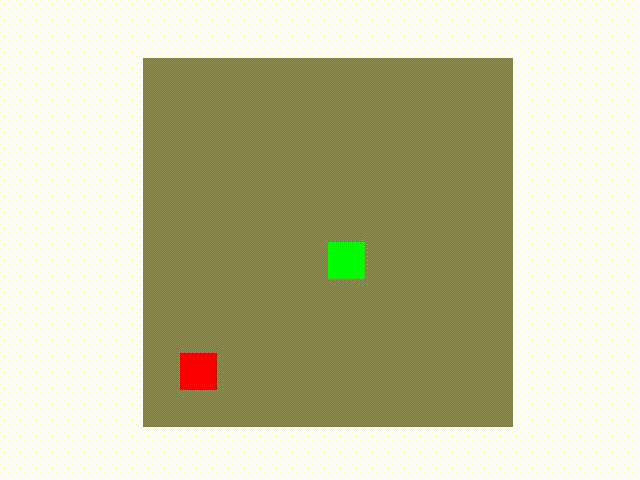

# 🐍 Reinforcement Learning for Snake Game

## 📌 Overview
This repository contains an implementation of a Reinforcement Learning (RL) agent that learns to play the Snake game using a Convolutional Neural Network (CNN) policy. The project is built using PyTorch and OpenAI Gym, utilizing multiple RL techniques including Policy Gradient and Random Agent Baseline.

## ✨ Features
- 🎮 Custom `SnakeEnv` built using OpenAI Gym
- 🧠 CNN-based policy network for reinforcement learning
- 📈 Training using the **Policy Gradient method**
- 🎯 Baseline **Random Agent** for comparison
- 🏆 Evaluation of the trained agent
- 🎥 Visualization of the agent's gameplay

## 🔧 Installation
### Prerequisites
Make sure you have the following dependencies installed:
- Python 3.8+
- PyTorch
- NumPy
- OpenAI Gym
- Matplotlib
- Pillow

To install the required dependencies, run:
```bash
pip install torch torchvision gym numpy matplotlib pillow
```

---

## 📜 Formal Definition of the Environment
The environment follows the **Markov Decision Process (MDP)** formulation with:
- **State Space (S):** A 2D grid representation of the Snake game. In our case 10x10 grid, each cell is 0 (empty cell), 1 (apple), or 2 (snake)
- **Action Space (A):** {Up, Down, Left, Right} (Discrete)
- **Transition Function (T):** Moves the snake in the chosen direction, updating the environment
- **Reward Function (R):**
  - Eating an apple: `+1`
  - Hitting a wall or itself: `-1` (game over)
  - Living time step: `0`

```python
class SnakeEnv(gym.Env):
    def __init__(self, grid_size=10, initial_length=3):
        self.grid_size = grid_size
        self.initial_length = initial_length
        self.action_space = spaces.Discrete(4)
        self.observation_space = spaces.Box(0, 2, (grid_size, grid_size), dtype=np.uint8)
        self.reset()
```

---

## 🏛️ Algorithms Used
### 🎲 Random Agent (Baseline)
A simple baseline agent that selects actions randomly:
- Acts as a control to measure improvement over random play
- Uses `random.choice()` to select a move from available actions
- Provides a benchmark for reinforcement learning models

```python
class RandomAgentPolicy():
    def act(self, state):
        return random.choice(list(range(4))), None
```

## 🎥 Random Agent Gameplay
Here is a demo of the random agent playing Snake:


### 🧠 Policy Gradient Method (Reinforcement Learning)
The main training approach used is the **Policy Gradient** method:

#### 🔍 Pseudocode
```
Initialize Policy Network π_θ
For each episode:
    Reset environment
    Observe initial state s_0
    While not terminal state:
        Sample action a_t ~ π_θ(s_t)
        Apply action, get reward r_t and next state s_{t+1}
        Store (s_t, a_t, r_t)
    Compute discounted rewards G_t
    Compute policy gradient loss L(θ)
    Update θ using gradient descent
```

#### 📝 Implementation
```python
def train(env, policy, optimizer, num_episodes=1000, gamma=0.95, max_steps=800, scheduler=None):
    train_rewards = []
    policy = policy.train()
    for episode in range(num_episodes):
        state, _ = env.reset()
        done = False
        log_probs = []
        rewards = []

        steps = 0
        while not done:
            action, log_prob = select_action(policy, state)
            next_state, reward, terminated, info = env.step(action)
            done = terminated

            log_probs.append(log_prob)
            rewards.append(reward)

            state = next_state
            steps += 1
            if steps > max_steps:
                done = True

        # Compute returns
        returns = []
        G = 0
        for r in reversed(rewards):
            G = r + gamma * G
            returns.insert(0, G)

        returns = torch.tensor(returns, dtype=torch.float32)
        returns = (returns - returns.mean()) / (returns.std() + 1e-9)  # Normalize returns

        # Compute loss and update policy
        loss = 0
        for log_prob, G in zip(log_probs, returns):
            loss -= log_prob * G

        optimizer.zero_grad()
        loss.backward()
        optimizer.step()

        train_rewards.append(sum(rewards))

    return train_rewards
```
## 🏗️ Hyperparameter Tuning
We experimented with various hyperparameters to optimize performance:

| Hyperparameter | Value Range | Best Found |
|---------------|------------|------------|
| Learning Rate | {1e-4, 1e-3, 1e-2} | `1e-3` |
| Discount Factor (γ) | {0.7, 0.9, 0.95} | `0.95` |
| Episodes | {5K, 10K, 20K, 30K} | `30K` |
| Max Steps | {500, 800, 1000} | `800` |

Rewards with epoch:




### 🤖 GPT Usage
GPT was used for:
- **Environment creation**: Creating a Snake game environment since the one in the PyGame was faulty
- **Hyperparameter insights**: Suggesting appropriate learning rates
- **Report generation**
- **Visualization**

---

## 📈 Results
- The agent improved significantly over the random policy.
- Average reward increased from `-0.5` (random) to `10.24+` (trained model).
- Training progress visualization:

```python
plt.plot(list(range(len(rewards))), rewards)
plt.xlabel("Episodes")
plt.ylabel("Total Reward")
plt.title("Training Progress")
plt.show()
```

### 🏆 Performance Metrics
Results were measured over 50 evaluation episodes:
| Model | Mean Reward | Standard Deviation |
|----------------|--------------|------------------|
| Random Agent | -0.98 | 0.14 |
| Trained v1 (γ=0.95, 5K episodes) | 0.06 | 0.58 |
| Trained v2 (γ=0.7, 5K episodes) | -0.42 | 0.57 |
| Trained v3 (γ=0.95, 20K episodes) | 4.0 | 2.72 |
| Trained v4 (γ=0.95, 30K episodes) | 10.24 | 5.24 |

---

## 🔮 Future Improvements
- 🚀 Implement **Deep Q-Network (DQN)** for better performance
- 🏗 Train on **larger grid sizes** for more complex strategies
- ⚡ Experiment with **different reward functions** for better learning

## 📜 License
This project is licensed under the MIT License.


